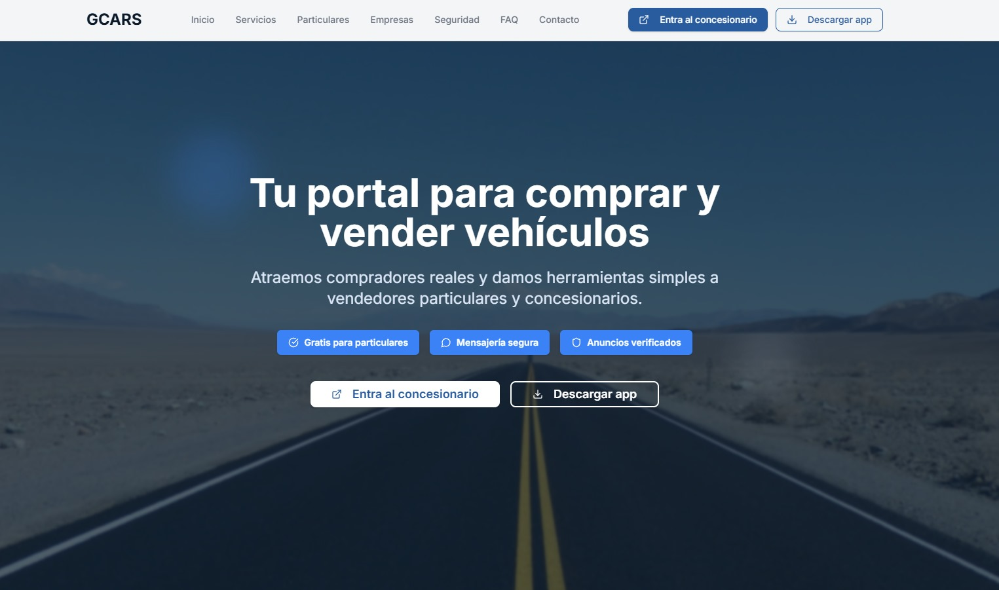

# GCARS-INFO-WEB
# 🌐 GCARS – Página Comercial

GCARS es un portal de compraventa de coches que conecta concesionarios y particulares.  
Este repositorio contiene la **página comercial** de la aplicación móvil, diseñada para presentar los servicios de la plataforma y facilitar la descarga de la app en **Android** e **iOS**.

---

## 📲 Sobre la App
GCARS permite a usuarios y concesionarios publicar, buscar y gestionar vehículos de forma sencilla.  
La web comercial sirve como **landing page** para atraer clientes, explicar el funcionamiento de la app y ofrecer acceso directo a las descargas oficiales.

- Disponible en **Google Play** y **App Store**.  
- Interfaz moderna y adaptada a cualquier dispositivo.  
- Enlace directo al concesionario online.

---

## 🖼️ Capturas de la Web

### 🏠 Home

### 📖 Cómo funciona

### ⭐ Reseñas

### 📱 Vista responsive

### 📂 Secciones

### 📥 Descarga

### ⚡ Footer

---

## 🛠️ Tecnologías utilizadas
- **React + TailwindCSS** – Componentes modernos y responsive.  
- **HTML5 + CSS3** – Estructura y estilos base.  
- **JavaScript (ES6+)** – Funcionalidad dinámica.  

---

## 🚀 Estado del Proyecto
Actualmente, la página web **aún no está publicada**, pero se encuentra en fase de desarrollo y pruebas.  
Este repositorio se usa para la **documentación y presentación visual** del proyecto.

---

## 📧 Contacto
Para más información sobre GCARS:  
**Web:** [https://gcars.es](https://gcars.es)  
**Email:** info@gcars.es
